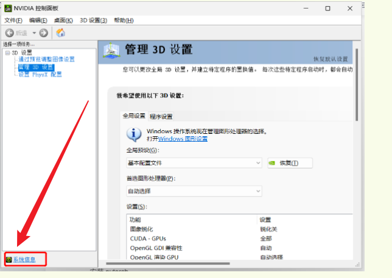
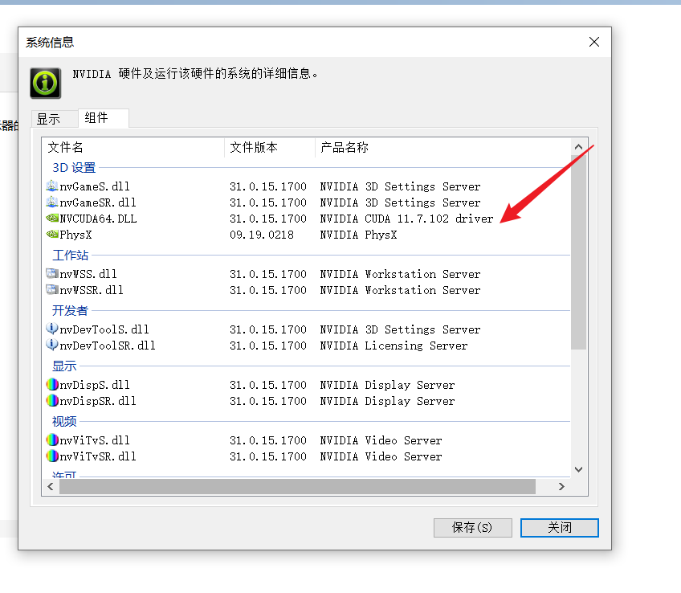
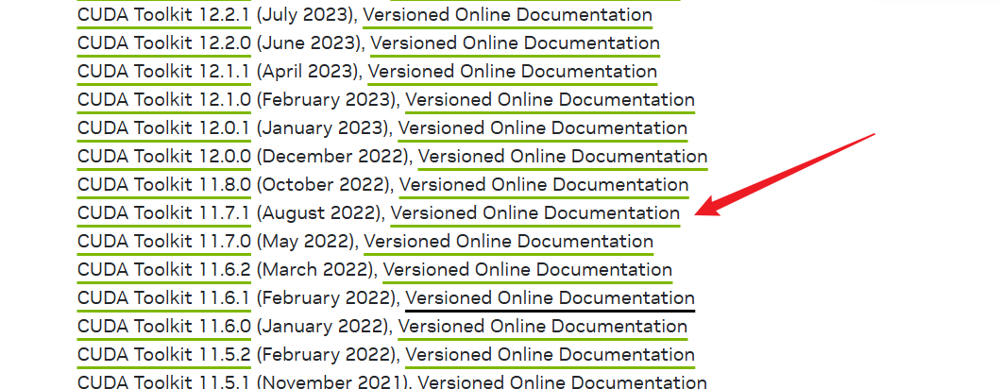
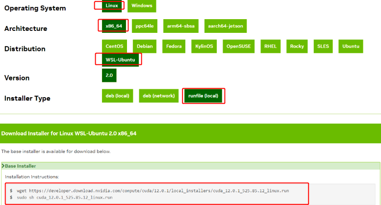
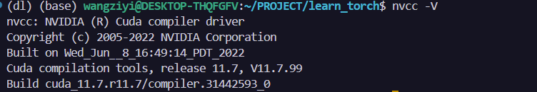

## 首先查看自己的显卡驱动版本





我的版本是11.7.102 所以一会选择CUDA的版本就是11.7.1

## 安装CUDA
在这个网址下载对应的CUDA版本
https://developer.nvidia.com/cuda-toolkit-archive

按照步骤 点击安装即可，这里版本一定要对上，否则会出现问题


得到这个安装命令，直接安装即可：
```shell
wget https://developer.download.nvidia.com/compute/cuda/11.7.1/local_installers/cuda_11.7.1_515.65.01_linux.run

sudo sh cuda_11.7.1_515.65.01_linux.run
```

下载比较的慢，且中途需要手动输入accept，之后会有下载选项，直接使用默认选项下载即可。

安装完毕之后使用下面的命令查看是否安装成功：
```shell
nvcc -V
```


这样CUDA就安好了！不要忘了在配置文件bashrc中添加如下命令,你需要将配置文件中的CUDA版本号也做修改！

```shell

export PATH=/usr/bin:$PATH

export PATH=/usr/local/cuda-11.7/bin:$PATH

export LD_LIBRARY_PATH=/usr/local/cuda-11.7/lib64:$LD_LIBRARY_PATH
```

## 安装miniconda

这一步比较简单，我们直接wget下载miniconda的安装包，然后安装即可
```shell
wget https://repo.anaconda.com/miniconda/Miniconda3-latest-Linux-x86_64.sh

chmod +x Miniconda3-latest-Linux-x86_64.sh

./Miniconda3-latest-Linux-x86_64.sh
```
一路同意即可，命令都很简单，由于默认安装过程会自动写入bashrc所以，安装好之后，千万不要忘记执行
```shell
source ~/.bashrc
```

对了 miniconda下载好之后别忘了建立一个虚拟环境，我们要在虚拟环境中安装torch，建立的命令如下：

```shell
conda create -n virtual_env_name python=3.8
```

## 安装torch

更简单只有一行命令：

```shell
conda install pytorch==2.0.0 torchvision==0.15.0 torchaudio==2.0.0 pytorch-cuda=11.7 -c pytorch -c nvidia
```

但是要注意，gpu版本只有个别发行版才有，最新的torch版本可能没有对应的CUDA版本，这里你需要去自己对照一下，否则你安装的就是CPU版本，好的wsl的安装就到此结束！


